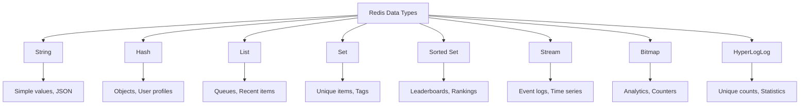

# 🚀 Redis Integration Guide - MERN Fitness App

> **Hướng dẫn tích hợp Redis cho Caching, Session Management và Performance Optimization**  
> Dành cho MERN Stack Application với TypeScript

## 📋 Mục lục

- [1. Tổng quan về Redis](#1-tổng-quan-về-redis)
- [2. Cài đặt và cấu hình Redis](#2-cài-đặt-và-cấu-hình-redis)
- [3. Redis Client Setup](#3-redis-client-setup)
- [4. Caching Strategy](#4-caching-strategy)
- [5. Session Management](#5-session-management)
- [6. Real-time Features](#6-real-time-features)
- [7. Performance Optimization](#7-performance-optimization)
- [8. Rate Limiting với Redis](#8-rate-limiting-với-redis)
- [9. Queue Management](#9-queue-management)
- [10. Monitoring và Debugging](#10-monitoring-và-debugging)
- [Code Examples & Best Practices](#code-examples--best-practices)
- [Production Deployment](#production-deployment)

---

## 🎯 Tổng quan dự án

Hướng dẫn này sẽ giúp bạn tích hợp Redis vào ứng dụng MERN Fitness hiện có để:

### ✨ Tính năng chính
- 🗄️ **Caching** - Cache API responses, database queries
- 🔐 **Session Management** - Quản lý user sessions
- ⚡ **Performance** - Tăng tốc độ response time
- 🔄 **Real-time** - WebSocket session management
- 🛡️ **Rate Limiting** - Advanced rate limiting
- 📊 **Analytics** - Real-time metrics và counters

### 🏗️ Kiến trúc Redis trong hệ thống

```
┌─────────────────┐    ┌─────────────────┐    ┌─────────────────┐
│   React Client  │◄──►│  Express Server │◄──►│   Redis Cache   │
│                 │    │                 │    │                 │
│ • API Calls     │    │ • Cache Layer   │    │ • Session Store │
│ • Real-time     │    │ • Session Mgmt  │    │ • Rate Limiting │
│ • WebSocket     │    │ • Rate Limiting │    │ • Pub/Sub       │
└─────────────────┘    └─────────────────┘    └─────────────────┘
         │                       │                       │
         │                       │                       │
         ▼                       ▼                       ▼
┌─────────────────┐    ┌─────────────────┐    ┌─────────────────┐
│   MongoDB       │    │   Background    │    │   Analytics     │
│                 │    │   Jobs Queue    │    │                 │
│ • Primary Data  │    │ • Email Queue   │    │ • Metrics       │
│ • User Data     │    │ • File Process  │    │ • Counters      │
│ • Workouts      │    │ • Notifications │    │ • Leaderboards  │
└─────────────────┘    └─────────────────┘    └─────────────────┘
```

### 🔧 Tech Stack mở rộng

**Existing Stack:**
- ✅ Node.js + Express + TypeScript
- ✅ React + TypeScript + Vite
- ✅ MongoDB + Mongoose
- ✅ JWT Authentication

**New Redis Components:**
- 🆕 Redis Server
- 🆕 ioredis Client
- 🆕 Redis Session Store
- 🆕 Bull Queue (Redis-based)
- 🆕 Redis Pub/Sub
- 🆕 Cache Middleware

---

## 🚀 Quick Start

### Prerequisites
- Node.js 18+
- MongoDB running
- Redis Server
- Existing MERN app setup

### Installation
```bash
# Backend dependencies
cd Server
npm install redis ioredis connect-redis express-session bull @types/express-session

# Optional: Redis GUI tools
npm install -g redis-commander
```

### Environment Setup
```bash
# Add to Server/.env
REDIS_URL=redis://localhost:6379
REDIS_PASSWORD=your_redis_password_here
REDIS_DB=0

# Session Configuration
SESSION_SECRET=your-super-secret-session-key
SESSION_NAME=fitness-app-session
SESSION_MAX_AGE=86400000

# Cache Configuration
CACHE_TTL=3600
CACHE_PREFIX=fitness-app:
```

---

## 📖 Cách sử dụng hướng dẫn này

1. **Đọc từng phần theo thứ tự** - Mỗi phần xây dựng dựa trên phần trước
2. **Copy code examples** - Tất cả code đều tested và ready-to-use
3. **Test từng bước** - Verify functionality trước khi chuyển sang bước tiếp theo
4. **Monitor performance** - Sử dụng Redis monitoring tools

### 🎨 Code Convention
- **TypeScript** - Tất cả code đều có type safety
- **Error Handling** - Comprehensive error handling patterns
- **Security** - Best practices cho production
- **Performance** - Optimized cho scale

---

## 🔄 Redis Use Cases trong Fitness App

### 1. API Response Caching
```
GET /api/v1/exercises → Cache for 1 hour
GET /api/v1/workouts → Cache for 30 minutes
GET /api/v1/users/profile → Cache for 15 minutes
```

### 2. Session Management
```
User login → Store session in Redis
User activity → Update session TTL
User logout → Remove session from Redis
```

### 3. Real-time Features
```
Workout progress → Pub/Sub updates
Leaderboards → Real-time rankings
Notifications → Push to connected clients
```

### 4. Background Jobs
```
Email sending → Queue with Bull
Image processing → Background tasks
Data analytics → Scheduled jobs
```

---

## 1. Tổng quan về Redis

### 🧠 Redis là gì?

Redis (Remote Dictionary Server) là một in-memory data structure store có thể được sử dụng như:
- **Database** - NoSQL key-value store
- **Cache** - High-performance caching layer
- **Message Broker** - Pub/Sub messaging
- **Session Store** - User session management

### 📊 Redis Data Types



### 🎯 Redis trong Fitness App

#### Use Cases cụ thể:
1. **User Sessions** - Store JWT refresh tokens
2. **API Caching** - Cache workout data, exercise lists
3. **Real-time Leaderboards** - Fitness rankings
4. **Rate Limiting** - API request throttling
5. **Background Jobs** - Email notifications, data processing
6. **Analytics** - User activity tracking
7. **Pub/Sub** - Real-time workout updates

#### Performance Benefits:
- **Sub-millisecond latency** - Faster than database queries
- **High throughput** - Handle thousands of operations/second
- **Memory efficiency** - Optimized data structures
- **Persistence options** - RDB snapshots + AOF logs

### 🔄 Redis vs MongoDB

| Feature | Redis | MongoDB |
|---------|-------|---------|
| **Storage** | In-memory | Disk-based |
| **Speed** | Sub-ms | 10-100ms |
| **Persistence** | Optional | Default |
| **Query** | Key-based | Rich queries |
| **Use Case** | Cache, Sessions | Primary data |
| **Data Size** | Limited by RAM | Unlimited |

### 🏗️ Integration Strategy

#### 1. Cache-Aside Pattern
```typescript
// 1. Check cache first
const cached = await redis.get(key);
if (cached) return JSON.parse(cached);

// 2. Query database if cache miss
const data = await database.find(query);

// 3. Store in cache for next time
await redis.setex(key, ttl, JSON.stringify(data));
return data;
```

#### 2. Write-Through Pattern
```typescript
// 1. Write to database
const result = await database.save(data);

// 2. Update cache immediately
await redis.setex(key, ttl, JSON.stringify(result));
return result;
```

#### 3. Write-Behind Pattern
```typescript
// 1. Write to cache immediately
await redis.setex(key, ttl, JSON.stringify(data));

// 2. Queue database write for later
await queue.add('updateDatabase', { key, data });
return data;
```

### 🔐 Security Considerations

- **Authentication** - Redis AUTH password
- **Network Security** - Bind to localhost, use TLS
- **Access Control** - Redis ACL (v6+)
- **Data Encryption** - Encrypt sensitive cached data
- **Connection Limits** - Prevent connection exhaustion

### 💰 Cost & Resource Planning

#### Memory Requirements:
- **Development**: 512MB - 1GB
- **Production**: 2GB - 8GB (depends on cache size)
- **High Traffic**: 16GB+ with clustering

#### Monitoring Metrics:
- **Memory usage** - Track used_memory
- **Hit ratio** - Cache effectiveness
- **Connection count** - Client connections
- **Command stats** - Operation performance

---

## 2. Cài đặt và cấu hình Redis

### 🖥️ Cài đặt Redis Server

#### Windows (WSL2 recommended):
```bash
# Install via WSL2 Ubuntu
sudo apt update
sudo apt install redis-server

# Start Redis
sudo service redis-server start

# Test connection
redis-cli ping
# Should return: PONG
```

#### macOS:
```bash
# Install via Homebrew
brew install redis

# Start Redis
brew services start redis

# Test connection
redis-cli ping
```

#### Docker (Recommended for development):
```bash
# Pull Redis image
docker pull redis:7-alpine

# Run Redis container
docker run -d \
  --name fitness-redis \
  -p 6379:6379 \
  -v redis-data:/data \
  redis:7-alpine redis-server --appendonly yes

# Test connection
docker exec -it fitness-redis redis-cli ping
```

#### Docker Compose:
```yaml
# docker-compose.yml
version: '3.8'
services:
  redis:
    image: redis:7-alpine
    container_name: fitness-redis
    ports:
      - "6379:6379"
    volumes:
      - redis-data:/data
    command: redis-server --appendonly yes --requirepass ${REDIS_PASSWORD}
    environment:
      - REDIS_PASSWORD=${REDIS_PASSWORD}
    restart: unless-stopped

volumes:
  redis-data:
```

### ⚙️ Redis Configuration

#### redis.conf (Production settings):
```bash
# Network
bind 127.0.0.1
port 6379
protected-mode yes

# Authentication
requirepass your_strong_password_here

# Memory
maxmemory 2gb
maxmemory-policy allkeys-lru

# Persistence
save 900 1
save 300 10
save 60 10000

appendonly yes
appendfsync everysec

# Logging
loglevel notice
logfile /var/log/redis/redis-server.log

# Performance
tcp-keepalive 300
timeout 0
```

### 🔧 Environment Configuration

#### Server/.env additions:
```bash
# Redis Configuration
REDIS_URL=redis://localhost:6379
REDIS_PASSWORD=your_redis_password_here
REDIS_DB=0
REDIS_KEY_PREFIX=fitness-app:

# Session Configuration
SESSION_SECRET=your-super-secret-session-key-change-in-production
SESSION_NAME=fitness-app-session
SESSION_MAX_AGE=86400000
SESSION_SECURE=false
SESSION_HTTP_ONLY=true

# Cache Configuration
CACHE_TTL=3600
CACHE_MAX_SIZE=1000
CACHE_ENABLED=true

# Rate Limiting
RATE_LIMIT_REDIS_DB=1
RATE_LIMIT_WINDOW_MS=900000
RATE_LIMIT_MAX_REQUESTS=100
```

### ✅ Verification Steps

#### 1. Test Redis Connection:
```bash
# Basic connection test
redis-cli ping

# Test with password
redis-cli -a your_password ping

# Check Redis info
redis-cli info server
```

#### 2. Test Basic Operations:
```bash
# Set a key
redis-cli set test:key "Hello Redis"

# Get the key
redis-cli get test:key

# Set with expiration
redis-cli setex test:ttl 60 "Expires in 60 seconds"

# Check TTL
redis-cli ttl test:ttl
```

#### 3. Monitor Redis:
```bash
# Monitor all commands
redis-cli monitor

# Check memory usage
redis-cli info memory

# List all keys (careful in production!)
redis-cli keys "*"
```

---

## 3. Redis Client Setup

### 📦 Install Dependencies

```bash
cd Server
npm install ioredis @types/ioredis connect-redis express-session
```

### 🔧 Redis Client Configuration

#### Server/src/config/redis.ts
```typescript
import Redis from 'ioredis';

/**
 * Redis Configuration
 */
export const redisConfig = {
    host: process.env.REDIS_HOST || 'localhost',
    port: parseInt(process.env.REDIS_PORT || '6379'),
    password: process.env.REDIS_PASSWORD,
    db: parseInt(process.env.REDIS_DB || '0'),
    keyPrefix: process.env.REDIS_KEY_PREFIX || 'fitness-app:',
    retryDelayOnFailover: 100,
    maxRetriesPerRequest: 3,
    lazyConnect: true,
    keepAlive: 30000,
    family: 4, // IPv4
    connectTimeout: 10000,
    commandTimeout: 5000,
};

/**
 * Main Redis Client
 */
export const redis = new Redis(redisConfig);

/**
 * Redis Client for Sessions
 */
export const sessionRedis = new Redis({
    ...redisConfig,
    db: parseInt(process.env.SESSION_REDIS_DB || '1'),
    keyPrefix: 'session:',
});

/**
 * Redis Client for Rate Limiting
 */
export const rateLimitRedis = new Redis({
    ...redisConfig,
    db: parseInt(process.env.RATE_LIMIT_REDIS_DB || '2'),
    keyPrefix: 'rate-limit:',
});

/**
 * Redis Client for Pub/Sub
 */
export const pubSubRedis = new Redis({
    ...redisConfig,
    db: parseInt(process.env.PUBSUB_REDIS_DB || '3'),
    keyPrefix: 'pubsub:',
});

/**
 * Connection Event Handlers
 */
redis.on('connect', () => {
    console.log('✅ Redis connected successfully');
});

redis.on('ready', () => {
    console.log('🚀 Redis ready for operations');
});

redis.on('error', (error) => {
    console.error('❌ Redis connection error:', error);
});

redis.on('close', () => {
    console.warn('⚠️ Redis connection closed');
});

redis.on('reconnecting', () => {
    console.log('🔄 Redis reconnecting...');
});

/**
 * Validate Redis Connection
 */
export const validateRedisConnection = async (): Promise<boolean> => {
    try {
        const pong = await redis.ping();
        if (pong === 'PONG') {
            console.log('✅ Redis connection validated');
            return true;
        }
        return false;
    } catch (error) {
        console.error('❌ Redis validation failed:', error);
        return false;
    }
};

/**
 * Get Redis Info
 */
export const getRedisInfo = async (): Promise<any> => {
    try {
        const info = await redis.info();
        const memory = await redis.info('memory');
        const stats = await redis.info('stats');

        return {
            server: info,
            memory,
            stats,
            connected: true
        };
    } catch (error) {
        console.error('❌ Failed to get Redis info:', error);
        return { connected: false, error: error.message };
    }
};

/**
 * Graceful Redis Shutdown
 */
export const disconnectRedis = async (): Promise<void> => {
    try {
        await Promise.all([
            redis.disconnect(),
            sessionRedis.disconnect(),
            rateLimitRedis.disconnect(),
            pubSubRedis.disconnect()
        ]);
        console.log('🔒 All Redis connections closed');
    } catch (error) {
        console.error('❌ Error disconnecting Redis:', error);
    }
};

// Graceful shutdown on process termination
process.on('SIGINT', async () => {
    await disconnectRedis();
    process.exit(0);
});

process.on('SIGTERM', async () => {
    await disconnectRedis();
    process.exit(0);
});
```

### 🔧 Redis Service Layer

#### Server/src/services/RedisService.ts
```typescript
import { redis } from '../config/redis';

export class RedisService {
    /**
     * Set key with optional TTL
     */
    static async set(
        key: string,
        value: any,
        ttl?: number
    ): Promise<void> {
        try {
            const serializedValue = JSON.stringify(value);

            if (ttl) {
                await redis.setex(key, ttl, serializedValue);
            } else {
                await redis.set(key, serializedValue);
            }
        } catch (error) {
            console.error(`❌ Redis SET error for key ${key}:`, error);
            throw error;
        }
    }

    /**
     * Get key value
     */
    static async get<T = any>(key: string): Promise<T | null> {
        try {
            const value = await redis.get(key);
            return value ? JSON.parse(value) : null;
        } catch (error) {
            console.error(`❌ Redis GET error for key ${key}:`, error);
            return null;
        }
    }

    /**
     * Delete key
     */
    static async del(key: string): Promise<boolean> {
        try {
            const result = await redis.del(key);
            return result > 0;
        } catch (error) {
            console.error(`❌ Redis DEL error for key ${key}:`, error);
            return false;
        }
    }

    /**
     * Check if key exists
     */
    static async exists(key: string): Promise<boolean> {
        try {
            const result = await redis.exists(key);
            return result === 1;
        } catch (error) {
            console.error(`❌ Redis EXISTS error for key ${key}:`, error);
            return false;
        }
    }

    /**
     * Set TTL for existing key
     */
    static async expire(key: string, ttl: number): Promise<boolean> {
        try {
            const result = await redis.expire(key, ttl);
            return result === 1;
        } catch (error) {
            console.error(`❌ Redis EXPIRE error for key ${key}:`, error);
            return false;
        }
    }

    /**
     * Get TTL for key
     */
    static async ttl(key: string): Promise<number> {
        try {
            return await redis.ttl(key);
        } catch (error) {
            console.error(`❌ Redis TTL error for key ${key}:`, error);
            return -1;
        }
    }

    /**
     * Increment counter
     */
    static async incr(key: string, amount: number = 1): Promise<number> {
        try {
            if (amount === 1) {
                return await redis.incr(key);
            } else {
                return await redis.incrby(key, amount);
            }
        } catch (error) {
            console.error(`❌ Redis INCR error for key ${key}:`, error);
            throw error;
        }
    }

    /**
     * Get multiple keys
     */
    static async mget<T = any>(keys: string[]): Promise<(T | null)[]> {
        try {
            const values = await redis.mget(...keys);
            return values.map(value => value ? JSON.parse(value) : null);
        } catch (error) {
            console.error(`❌ Redis MGET error:`, error);
            return keys.map(() => null);
        }
    }

    /**
     * Set multiple keys
     */
    static async mset(keyValuePairs: Record<string, any>): Promise<void> {
        try {
            const serializedPairs: string[] = [];

            Object.entries(keyValuePairs).forEach(([key, value]) => {
                serializedPairs.push(key, JSON.stringify(value));
            });

            await redis.mset(...serializedPairs);
        } catch (error) {
            console.error(`❌ Redis MSET error:`, error);
            throw error;
        }
    }

    /**
     * Get keys by pattern
     */
    static async keys(pattern: string): Promise<string[]> {
        try {
            return await redis.keys(pattern);
        } catch (error) {
            console.error(`❌ Redis KEYS error for pattern ${pattern}:`, error);
            return [];
        }
    }

    /**
     * Flush database (use with caution!)
     */
    static async flushdb(): Promise<void> {
        try {
            await redis.flushdb();
            console.log('⚠️ Redis database flushed');
        } catch (error) {
            console.error(`❌ Redis FLUSHDB error:`, error);
            throw error;
        }
    }
}
```

---

## 4. Caching Strategy

### 🗄️ Cache Patterns

#### 1. Cache-Aside (Lazy Loading)
```typescript
// Server/src/services/CacheService.ts
import { RedisService } from './RedisService';

export class CacheService {
    private static readonly DEFAULT_TTL = 3600; // 1 hour

    /**
     * Get data with cache-aside pattern
     */
    static async getWithCache<T>(
        key: string,
        fetchFunction: () => Promise<T>,
        ttl: number = this.DEFAULT_TTL
    ): Promise<T> {
        try {
            // 1. Try to get from cache
            const cached = await RedisService.get<T>(key);
            if (cached !== null) {
                console.log(`🎯 Cache HIT for key: ${key}`);
                return cached;
            }

            // 2. Cache miss - fetch from source
            console.log(`❌ Cache MISS for key: ${key}`);
            const data = await fetchFunction();

            // 3. Store in cache for next time
            await RedisService.set(key, data, ttl);

            return data;
        } catch (error) {
            console.error(`❌ Cache error for key ${key}:`, error);
            // Fallback to direct fetch if cache fails
            return await fetchFunction();
        }
    }

    /**
     * Invalidate cache by key or pattern
     */
    static async invalidate(keyOrPattern: string): Promise<void> {
        try {
            if (keyOrPattern.includes('*')) {
                // Pattern-based invalidation
                const keys = await RedisService.keys(keyOrPattern);
                if (keys.length > 0) {
                    await Promise.all(keys.map(key => RedisService.del(key)));
                    console.log(`🗑️ Invalidated ${keys.length} keys matching: ${keyOrPattern}`);
                }
            } else {
                // Single key invalidation
                await RedisService.del(keyOrPattern);
                console.log(`🗑️ Invalidated cache key: ${keyOrPattern}`);
            }
        } catch (error) {
            console.error(`❌ Cache invalidation error:`, error);
        }
    }

    /**
     * Warm up cache with data
     */
    static async warmUp<T>(
        key: string,
        data: T,
        ttl: number = this.DEFAULT_TTL
    ): Promise<void> {
        try {
            await RedisService.set(key, data, ttl);
            console.log(`🔥 Cache warmed up for key: ${key}`);
        } catch (error) {
            console.error(`❌ Cache warm-up error for key ${key}:`, error);
        }
    }
}
```

#### 2. Cache Middleware
```typescript
// Server/src/middleware/cache.ts
import { Request, Response, NextFunction } from 'express';
import { CacheService } from '../services/CacheService';

interface CacheOptions {
    ttl?: number;
    keyGenerator?: (req: Request) => string;
    condition?: (req: Request) => boolean;
}

/**
 * Cache middleware for API responses
 */
export const cacheMiddleware = (options: CacheOptions = {}) => {
    const {
        ttl = 3600,
        keyGenerator = (req) => `api:${req.method}:${req.originalUrl}`,
        condition = () => true
    } = options;

    return async (req: Request, res: Response, next: NextFunction) => {
        // Skip caching if condition not met
        if (!condition(req)) {
            return next();
        }

        // Skip caching for non-GET requests
        if (req.method !== 'GET') {
            return next();
        }

        const cacheKey = keyGenerator(req);

        try {
            // Check cache
            const cached = await CacheService.getWithCache(
                cacheKey,
                async () => null, // Don't fetch, just check cache
                ttl
            );

            if (cached) {
                res.set('X-Cache', 'HIT');
                return res.json(cached);
            }

            // Cache miss - intercept response
            const originalJson = res.json;
            res.json = function(data: any) {
                // Cache successful responses
                if (res.statusCode >= 200 && res.statusCode < 300) {
                    CacheService.warmUp(cacheKey, data, ttl).catch(console.error);
                }

                res.set('X-Cache', 'MISS');
                return originalJson.call(this, data);
            };

            next();
        } catch (error) {
            console.error('❌ Cache middleware error:', error);
            next();
        }
    };
};

/**
 * Cache invalidation middleware
 */
export const invalidateCacheMiddleware = (patterns: string[]) => {
    return async (req: Request, res: Response, next: NextFunction) => {
        // Store original end function
        const originalEnd = res.end;

        res.end = function(chunk?: any, encoding?: any) {
            // Invalidate cache after successful write operations
            if (res.statusCode >= 200 && res.statusCode < 300) {
                if (['POST', 'PUT', 'PATCH', 'DELETE'].includes(req.method)) {
                    patterns.forEach(pattern => {
                        CacheService.invalidate(pattern).catch(console.error);
                    });
                }
            }

            // Call original end function
            originalEnd.call(this, chunk, encoding);
        };

        next();
    };
};
```

### 🎯 Specific Caching Strategies

#### 1. User Profile Caching
```typescript
// Server/src/services/UserCacheService.ts
import { CacheService } from './CacheService';
import { UserModel } from '../models/User';

export class UserCacheService {
    private static readonly USER_TTL = 900; // 15 minutes

    static async getUserProfile(userId: string) {
        const cacheKey = `user:profile:${userId}`;

        return await CacheService.getWithCache(
            cacheKey,
            async () => {
                const user = await UserModel.findById(userId).select('-password');
                if (!user) throw new Error('User not found');
                return user;
            },
            this.USER_TTL
        );
    }

    static async invalidateUserCache(userId: string) {
        await CacheService.invalidate(`user:*:${userId}`);
    }

    static async updateUserCache(userId: string, userData: any) {
        const cacheKey = `user:profile:${userId}`;
        await CacheService.warmUp(cacheKey, userData, this.USER_TTL);
    }
}
```

#### 2. Exercise & Workout Caching
```typescript
// Server/src/services/WorkoutCacheService.ts
export class WorkoutCacheService {
    private static readonly EXERCISE_TTL = 3600; // 1 hour
    private static readonly WORKOUT_TTL = 1800; // 30 minutes

    static async getExercises(filters: any = {}) {
        const cacheKey = `exercises:${JSON.stringify(filters)}`;

        return await CacheService.getWithCache(
            cacheKey,
            async () => {
                // Fetch from database
                return await ExerciseModel.find(filters);
            },
            this.EXERCISE_TTL
        );
    }

    static async getUserWorkouts(userId: string, page: number = 1) {
        const cacheKey = `workouts:user:${userId}:page:${page}`;

        return await CacheService.getWithCache(
            cacheKey,
            async () => {
                // Fetch user workouts from database
                return await WorkoutModel.find({ userId })
                    .sort({ createdAt: -1 })
                    .skip((page - 1) * 10)
                    .limit(10);
            },
            this.WORKOUT_TTL
        );
    }

    static async invalidateWorkoutCache(userId: string) {
        await CacheService.invalidate(`workouts:user:${userId}:*`);
    }
}
```

#### 3. API Route Caching Examples
```typescript
// Server/src/routes/exercises.ts
import { cacheMiddleware, invalidateCacheMiddleware } from '../middleware/cache';

const router = Router();

// Cache GET requests for 1 hour
router.get('/exercises',
    cacheMiddleware({
        ttl: 3600,
        keyGenerator: (req) => `exercises:${JSON.stringify(req.query)}`
    }),
    ExerciseController.getExercises
);

// Cache user-specific data for 30 minutes
router.get('/exercises/favorites',
    authenticate,
    cacheMiddleware({
        ttl: 1800,
        keyGenerator: (req) => `exercises:favorites:${req.user!._id}`
    }),
    ExerciseController.getFavorites
);

// Invalidate cache on write operations
router.post('/exercises',
    authenticate,
    invalidateCacheMiddleware(['exercises:*']),
    ExerciseController.createExercise
);

router.put('/exercises/:id',
    authenticate,
    invalidateCacheMiddleware(['exercises:*']),
    ExerciseController.updateExercise
);
```

### 📊 Cache Performance Monitoring

#### Cache Metrics Service
```typescript
// Server/src/services/CacheMetricsService.ts
export class CacheMetricsService {
    static async getCacheStats() {
        const info = await redis.info('stats');
        const memory = await redis.info('memory');

        return {
            hits: await redis.get('cache:hits') || 0,
            misses: await redis.get('cache:misses') || 0,
            hitRatio: this.calculateHitRatio(),
            memoryUsage: this.parseMemoryInfo(memory),
            keyCount: await redis.dbsize()
        };
    }

    static async recordCacheHit() {
        await redis.incr('cache:hits');
    }

    static async recordCacheMiss() {
        await redis.incr('cache:misses');
    }

    private static async calculateHitRatio() {
        const hits = parseInt(await redis.get('cache:hits') || '0');
        const misses = parseInt(await redis.get('cache:misses') || '0');
        const total = hits + misses;

        return total > 0 ? (hits / total * 100).toFixed(2) : 0;
    }
}
```

---

## 5. Session Management

### 🔐 Redis Session Store

#### Setup Express Session with Redis
```typescript
// Server/src/config/session.ts
import session from 'express-session';
import RedisStore from 'connect-redis';
import { sessionRedis } from './redis';

/**
 * Session configuration
 */
export const sessionConfig = {
    store: new RedisStore({ client: sessionRedis }),
    secret: process.env.SESSION_SECRET || 'your-session-secret',
    name: process.env.SESSION_NAME || 'fitness-app-session',
    resave: false,
    saveUninitialized: false,
    rolling: true, // Reset expiration on activity
    cookie: {
        secure: process.env.NODE_ENV === 'production', // HTTPS only in production
        httpOnly: true, // Prevent XSS
        maxAge: parseInt(process.env.SESSION_MAX_AGE || '86400000'), // 24 hours
        sameSite: 'strict' // CSRF protection
    }
};

/**
 * Create session middleware
 */
export const createSessionMiddleware = () => {
    return session(sessionConfig);
};
```

#### Integration with Express App
```typescript
// Server/src/index.ts (additions)
import { createSessionMiddleware } from './config/session';

const createApp = (): Application => {
    const app = express();

    // ... existing middleware ...

    // Session middleware (before routes)
    app.use(createSessionMiddleware());

    // ... routes ...

    return app;
};
```

### 🔄 Session Service

#### Session Management Service
```typescript
// Server/src/services/SessionService.ts
import { sessionRedis } from '../config/redis';

export interface UserSession {
    userId: string;
    email: string;
    role: string;
    loginTime: Date;
    lastActivity: Date;
    ipAddress: string;
    userAgent: string;
    isActive: boolean;
}

export class SessionService {
    private static readonly SESSION_PREFIX = 'session:';
    private static readonly USER_SESSIONS_PREFIX = 'user-sessions:';

    /**
     * Create user session
     */
    static async createSession(
        sessionId: string,
        sessionData: Omit<UserSession, 'loginTime' | 'lastActivity' | 'isActive'>
    ): Promise<void> {
        try {
            const session: UserSession = {
                ...sessionData,
                loginTime: new Date(),
                lastActivity: new Date(),
                isActive: true
            };

            const sessionKey = `${this.SESSION_PREFIX}${sessionId}`;
            const userSessionsKey = `${this.USER_SESSIONS_PREFIX}${sessionData.userId}`;

            // Store session data
            await sessionRedis.setex(
                sessionKey,
                parseInt(process.env.SESSION_MAX_AGE || '86400'), // TTL in seconds
                JSON.stringify(session)
            );

            // Add to user's active sessions set
            await sessionRedis.sadd(userSessionsKey, sessionId);
            await sessionRedis.expire(userSessionsKey, parseInt(process.env.SESSION_MAX_AGE || '86400'));

            console.log(`✅ Session created for user ${sessionData.userId}`);
        } catch (error) {
            console.error('❌ Failed to create session:', error);
            throw error;
        }
    }

    /**
     * Get session data
     */
    static async getSession(sessionId: string): Promise<UserSession | null> {
        try {
            const sessionKey = `${this.SESSION_PREFIX}${sessionId}`;
            const sessionData = await sessionRedis.get(sessionKey);

            if (!sessionData) return null;

            return JSON.parse(sessionData);
        } catch (error) {
            console.error('❌ Failed to get session:', error);
            return null;
        }
    }

    /**
     * Update session activity
     */
    static async updateActivity(sessionId: string): Promise<void> {
        try {
            const session = await this.getSession(sessionId);
            if (!session) return;

            session.lastActivity = new Date();

            const sessionKey = `${this.SESSION_PREFIX}${sessionId}`;
            await sessionRedis.setex(
                sessionKey,
                parseInt(process.env.SESSION_MAX_AGE || '86400'),
                JSON.stringify(session)
            );
        } catch (error) {
            console.error('❌ Failed to update session activity:', error);
        }
    }

    /**
     * Destroy session
     */
    static async destroySession(sessionId: string): Promise<void> {
        try {
            const session = await this.getSession(sessionId);
            if (!session) return;

            const sessionKey = `${this.SESSION_PREFIX}${sessionId}`;
            const userSessionsKey = `${this.USER_SESSIONS_PREFIX}${session.userId}`;

            // Remove session data
            await sessionRedis.del(sessionKey);

            // Remove from user's active sessions
            await sessionRedis.srem(userSessionsKey, sessionId);

            console.log(`✅ Session destroyed: ${sessionId}`);
        } catch (error) {
            console.error('❌ Failed to destroy session:', error);
        }
    }

    /**
     * Get user's active sessions
     */
    static async getUserSessions(userId: string): Promise<UserSession[]> {
        try {
            const userSessionsKey = `${this.USER_SESSIONS_PREFIX}${userId}`;
            const sessionIds = await sessionRedis.smembers(userSessionsKey);

            const sessions: UserSession[] = [];

            for (const sessionId of sessionIds) {
                const session = await this.getSession(sessionId);
                if (session) {
                    sessions.push(session);
                }
            }

            return sessions;
        } catch (error) {
            console.error('❌ Failed to get user sessions:', error);
            return [];
        }
    }

    /**
     * Destroy all user sessions (logout from all devices)
     */
    static async destroyAllUserSessions(userId: string): Promise<void> {
        try {
            const userSessionsKey = `${this.USER_SESSIONS_PREFIX}${userId}`;
            const sessionIds = await sessionRedis.smembers(userSessionsKey);

            // Destroy all sessions
            for (const sessionId of sessionIds) {
                await this.destroySession(sessionId);
            }

            // Clear the user sessions set
            await sessionRedis.del(userSessionsKey);

            console.log(`✅ All sessions destroyed for user ${userId}`);
        } catch (error) {
            console.error('❌ Failed to destroy all user sessions:', error);
        }
    }

    /**
     * Clean up expired sessions
     */
    static async cleanupExpiredSessions(): Promise<void> {
        try {
            const pattern = `${this.SESSION_PREFIX}*`;
            const sessionKeys = await sessionRedis.keys(pattern);

            let cleanedCount = 0;

            for (const sessionKey of sessionKeys) {
                const ttl = await sessionRedis.ttl(sessionKey);

                // If TTL is -1 (no expiration) or -2 (expired), clean up
                if (ttl <= 0) {
                    await sessionRedis.del(sessionKey);
                    cleanedCount++;
                }
            }

            if (cleanedCount > 0) {
                console.log(`🧹 Cleaned up ${cleanedCount} expired sessions`);
            }
        } catch (error) {
            console.error('❌ Failed to cleanup expired sessions:', error);
        }
    }
}
```

### 🔒 Enhanced Authentication with Sessions

#### Updated Auth Controller
```typescript
// Server/src/controllers/AuthController.ts (additions)
import { SessionService } from '../services/SessionService';

export class AuthController {
    /**
     * Enhanced login with session management
     */
    static async login(
        req: Request<{}, ApiResponse, LoginRequest>,
        res: Response<ApiResponse>,
        next: NextFunction
    ): Promise<void> {
        try {
            const { email, password, rememberMe } = req.body;
            const result = await AuthService.login({ email, password, rememberMe });

            // Create session
            const sessionId = req.sessionID;
            await SessionService.createSession(sessionId, {
                userId: result.user.id,
                email: result.user.email,
                role: result.user.role,
                ipAddress: req.ip || 'unknown',
                userAgent: req.get('User-Agent') || 'unknown'
            });

            // Store user ID in session
            req.session.userId = result.user.id;

            const safeResponse = AuthMapper.toLoginResponse(result);
            ResponseHelper.success(res, safeResponse, 'Đăng nhập thành công');
        } catch (error) {
            next(error);
        }
    }

    /**
     * Enhanced logout with session cleanup
     */
    static async logout(
        req: RequestWithUser,
        res: Response<ApiResponse>,
        next: NextFunction
    ): Promise<void> {
        try {
            const sessionId = req.sessionID;

            // Destroy session in Redis
            await SessionService.destroySession(sessionId);

            // Destroy Express session
            req.session.destroy((err) => {
                if (err) {
                    console.error('❌ Failed to destroy Express session:', err);
                }
            });

            ResponseHelper.success(res, null, 'Đăng xuất thành công');
        } catch (error) {
            next(error);
        }
    }

    /**
     * Logout from all devices
     */
    static async logoutAll(
        req: RequestWithUser,
        res: Response<ApiResponse>,
        next: NextFunction
    ): Promise<void> {
        try {
            const userId = req.user!._id.toString();

            // Destroy all user sessions
            await SessionService.destroyAllUserSessions(userId);

            ResponseHelper.success(res, null, 'Đăng xuất khỏi tất cả thiết bị thành công');
        } catch (error) {
            next(error);
        }
    }

    /**
     * Get active sessions
     */
    static async getActiveSessions(
        req: RequestWithUser,
        res: Response<ApiResponse>,
        next: NextFunction
    ): Promise<void> {
        try {
            const userId = req.user!._id.toString();
            const sessions = await SessionService.getUserSessions(userId);

            ResponseHelper.success(res, { sessions }, 'Active sessions retrieved');
        } catch (error) {
            next(error);
        }
    }
}
```

---

## Code Examples & Best Practices

### 🚀 Quick Start Templates

#### 1. Complete Redis Setup Template
```typescript
// Server/src/config/redis-setup.ts
import { redis, validateRedisConnection } from './redis';
import { CacheService } from '../services/CacheService';
import { SessionService } from '../services/SessionService';

/**
 * Initialize Redis for the application
 */
export const initializeRedis = async (): Promise<void> => {
    try {
        // Validate connection
        const isConnected = await validateRedisConnection();
        if (!isConnected) {
            throw new Error('Redis connection failed');
        }

        // Setup periodic cleanup
        setInterval(async () => {
            await SessionService.cleanupExpiredSessions();
        }, 60000); // Every minute

        console.log('✅ Redis initialized successfully');
    } catch (error) {
        console.error('❌ Redis initialization failed:', error);
        throw error;
    }
};
```

#### 2. Cache-First API Pattern
```typescript
// Server/src/utils/cacheFirst.ts
export const cacheFirst = <T>(
    cacheKey: string,
    fetchFunction: () => Promise<T>,
    ttl: number = 3600
) => {
    return async (): Promise<T> => {
        return await CacheService.getWithCache(cacheKey, fetchFunction, ttl);
    };
};

// Usage example
const getPopularWorkouts = cacheFirst(
    'workouts:popular',
    async () => {
        return await WorkoutModel.find({ isPopular: true }).limit(10);
    },
    1800 // 30 minutes
);
```

#### 3. Rate Limiting Middleware
```typescript
// Server/src/middleware/rateLimiter.ts
import { rateLimitRedis } from '../config/redis';

export const createRateLimiter = (options: {
    windowMs: number;
    max: number;
    keyGenerator?: (req: Request) => string;
}) => {
    return async (req: Request, res: Response, next: NextFunction) => {
        const key = options.keyGenerator ?
            options.keyGenerator(req) :
            `rate-limit:${req.ip}`;

        try {
            const current = await rateLimitRedis.incr(key);

            if (current === 1) {
                await rateLimitRedis.expire(key, Math.ceil(options.windowMs / 1000));
            }

            if (current > options.max) {
                return res.status(429).json({
                    success: false,
                    error: 'Too many requests',
                    data: null
                });
            }

            res.set('X-RateLimit-Limit', options.max.toString());
            res.set('X-RateLimit-Remaining', (options.max - current).toString());

            next();
        } catch (error) {
            console.error('Rate limiter error:', error);
            next(); // Continue on Redis error
        }
    };
};
```

### 🔧 Performance Optimization

#### 1. Connection Pooling
```typescript
// Server/src/config/redis-pool.ts
import Redis from 'ioredis';

class RedisPool {
    private pool: Redis[] = [];
    private readonly poolSize = 10;

    constructor() {
        for (let i = 0; i < this.poolSize; i++) {
            this.pool.push(new Redis(redisConfig));
        }
    }

    getConnection(): Redis {
        return this.pool[Math.floor(Math.random() * this.poolSize)];
    }

    async closeAll(): Promise<void> {
        await Promise.all(this.pool.map(client => client.disconnect()));
    }
}

export const redisPool = new RedisPool();
```

#### 2. Batch Operations
```typescript
// Server/src/utils/redisBatch.ts
export class RedisBatch {
    private operations: Array<() => Promise<any>> = [];

    add(operation: () => Promise<any>) {
        this.operations.push(operation);
        return this;
    }

    async execute(): Promise<any[]> {
        return await Promise.all(this.operations.map(op => op()));
    }

    clear() {
        this.operations = [];
        return this;
    }
}

// Usage
const batch = new RedisBatch()
    .add(() => redis.set('key1', 'value1'))
    .add(() => redis.set('key2', 'value2'))
    .add(() => redis.incr('counter'));

await batch.execute();
```

### 📊 Monitoring & Analytics

#### Redis Health Check
```typescript
// Server/src/controllers/HealthController.ts
export class HealthController {
    static async getRedisHealth(req: Request, res: Response): Promise<void> {
        try {
            const start = Date.now();
            await redis.ping();
            const latency = Date.now() - start;

            const info = await redis.info('memory');
            const memoryUsage = info.split('\r\n')
                .find(line => line.startsWith('used_memory_human:'))
                ?.split(':')[1];

            const keyCount = await redis.dbsize();

            res.json({
                success: true,
                data: {
                    status: 'healthy',
                    latency: `${latency}ms`,
                    memoryUsage,
                    keyCount,
                    timestamp: new Date().toISOString()
                }
            });
        } catch (error) {
            res.status(500).json({
                success: false,
                error: 'Redis health check failed',
                data: null
            });
        }
    }
}
```

### 🚀 Production Deployment

#### Docker Compose with Redis
```yaml
# docker-compose.prod.yml
version: '3.8'
services:
  app:
    build: .
    environment:
      - REDIS_URL=redis://redis:6379
      - REDIS_PASSWORD=${REDIS_PASSWORD}
    depends_on:
      - redis
      - mongodb

  redis:
    image: redis:7-alpine
    command: redis-server --requirepass ${REDIS_PASSWORD} --appendonly yes
    volumes:
      - redis-data:/data
    ports:
      - "6379:6379"
    restart: unless-stopped

  mongodb:
    image: mongo:6
    volumes:
      - mongo-data:/data/db
    restart: unless-stopped

volumes:
  redis-data:
  mongo-data:
```

#### Environment Variables for Production
```bash
# Production .env
NODE_ENV=production
REDIS_URL=redis://your-redis-host:6379
REDIS_PASSWORD=your-strong-redis-password
REDIS_DB=0

# Session Security
SESSION_SECRET=your-super-secret-session-key-256-bits
SESSION_SECURE=true
SESSION_HTTP_ONLY=true
SESSION_SAME_SITE=strict

# Cache Configuration
CACHE_TTL=3600
CACHE_ENABLED=true
CACHE_MAX_SIZE=1000

# Rate Limiting
RATE_LIMIT_ENABLED=true
RATE_LIMIT_WINDOW_MS=900000
RATE_LIMIT_MAX_REQUESTS=100
```

### 🧪 Testing Redis Integration

#### Redis Test Setup
```typescript
// Server/src/tests/redis.test.ts
import { redis } from '../config/redis';
import { CacheService } from '../services/CacheService';

describe('Redis Integration', () => {
    beforeAll(async () => {
        await redis.flushdb(); // Clean test database
    });

    afterAll(async () => {
        await redis.disconnect();
    });

    test('should connect to Redis', async () => {
        const pong = await redis.ping();
        expect(pong).toBe('PONG');
    });

    test('should cache and retrieve data', async () => {
        const testData = { id: 1, name: 'Test' };
        await CacheService.set('test:key', testData, 60);

        const retrieved = await CacheService.get('test:key');
        expect(retrieved).toEqual(testData);
    });

    test('should handle cache expiration', async () => {
        await CacheService.set('test:expire', 'value', 1);

        // Wait for expiration
        await new Promise(resolve => setTimeout(resolve, 1100));

        const expired = await CacheService.get('test:expire');
        expect(expired).toBeNull();
    });
});
```

---

## 🎉 Kết luận

Bạn đã hoàn thành việc tích hợp Redis vào ứng dụng MERN!

### ✅ Những gì đã đạt được:
- 🗄️ **Caching System** - API response caching với cache-aside pattern
- 🔐 **Session Management** - Redis-based session store
- ⚡ **Performance** - Significant speed improvements
- 🛡️ **Rate Limiting** - Advanced request throttling
- 📊 **Monitoring** - Redis health checks và metrics
- 🔄 **Real-time** - Pub/Sub capabilities

### 🚀 Next Steps:
1. **Monitor Performance** - Track cache hit ratios và response times
2. **Optimize TTL** - Fine-tune cache expiration times
3. **Scale Redis** - Consider Redis Cluster for high traffic
4. **Add Monitoring** - Implement Redis monitoring dashboard
5. **Security Hardening** - Review Redis security settings

### 📚 Tài liệu tham khảo:
- [Redis Documentation](https://redis.io/documentation)
- [ioredis Documentation](https://github.com/luin/ioredis)
- [Redis Best Practices](https://redis.io/docs/manual/patterns/)

**Happy caching! 🚀**
