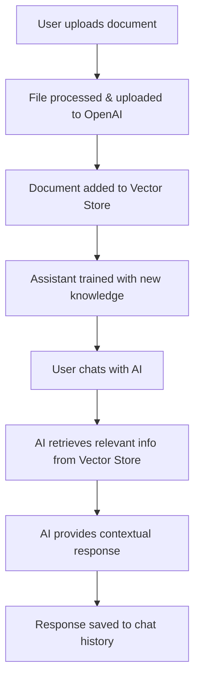
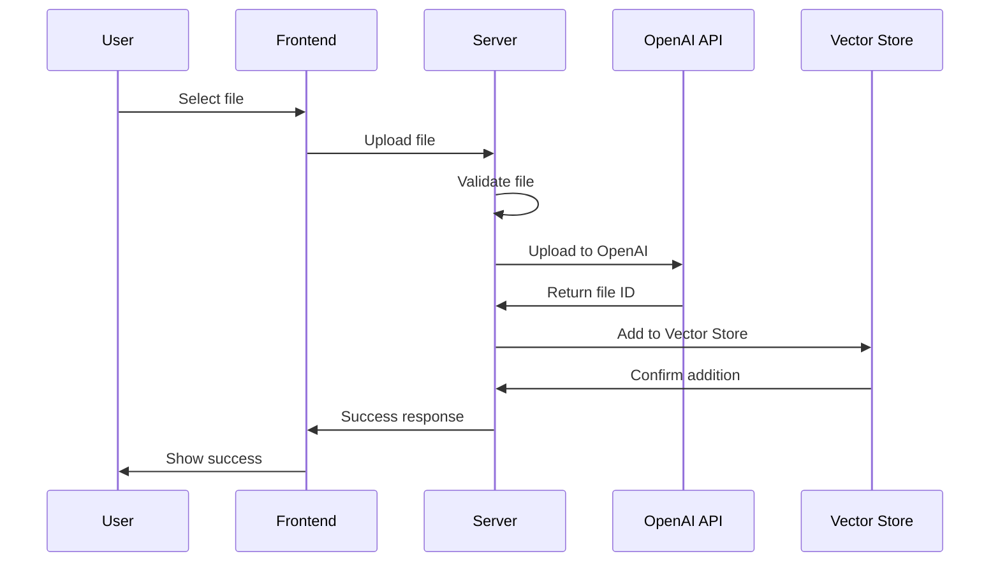
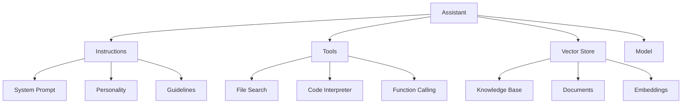

# 🤖 AI Integration Guide - MERN Fitness App

> **Hướng dẫn tích hợp AI Chatbot với OpenAI Assistant API, Vector Store và File Upload**  
> Dành cho MERN Stack Application với TypeScript

## 📋 Mục lục

- [1. Tổng quan về tích hợp AI](#1-tổng-quan-về-tích-hợp-ai)
- [2. Cấu hình OpenAI và môi trường](#2-cấu-hình-openai-và-môi-trường)
- [3. Xây dựng hệ thống upload file](#3-xây-dựng-hệ-thống-upload-file)
- [4. Tạo và quản lý OpenAI Assistant](#4-tạo-và-quản-lý-openai-assistant)
- [5. Xây dựng chatbot interface](#5-xây-dựng-chatbot-interface)
- [6. Training chatbot với documents](#6-training-chatbot-với-documents)
- [7. Backend API implementation](#7-backend-api-implementation)
- [8. Frontend integration](#8-frontend-integration)
- [9. Testing và debugging](#9-testing-và-debugging)
- [10. Deployment và production](#10-deployment-và-production)
- [Code Examples & Templates](#code-examples--templates)
- [Troubleshooting & FAQ](#troubleshooting--faq)

---

## 🎯 Tổng quan dự án

Hướng dẫn này sẽ giúp bạn tích hợp AI chatbot vào ứng dụng MERN Fitness hiện có với các tính năng:

### ✨ Tính năng chính
- 🤖 **AI Chatbot** - Trợ lý thông minh cho fitness advice
- 📁 **File Upload Management** - Upload documents lên OpenAI
- 🧠 **Document Training** - Training chatbot với knowledge base
- 💬 **Real-time Chat** - Giao tiếp thời gian thực
- 📊 **Analytics** - Theo dõi hiệu suất chatbot

### 🏗️ Kiến trúc hệ thống

```
┌─────────────────┐    ┌─────────────────┐    ┌─────────────────┐
│   React Client  │◄──►│  Express Server │◄──►│   OpenAI API    │
│                 │    │                 │    │                 │
│ • Chat UI       │    │ • File Upload   │    │ • Assistant API │
│ • File Upload   │    │ • Chat API      │    │ • Vector Store  │
│ • Real-time     │    │ • WebSocket     │    │ • File API      │
└─────────────────┘    └─────────────────┘    └─────────────────┘
         │                       │                       │
         │                       │                       │
         ▼                       ▼                       ▼
┌─────────────────┐    ┌─────────────────┐    ┌─────────────────┐
│   MongoDB       │    │   Cloudinary    │    │   Vector Store  │
│                 │    │                 │    │                 │
│ • Chat History  │    │ • Media Files   │    │ • Documents     │
│ • User Data     │    │ • Images        │    │ • Embeddings    │
│ • Assistant     │    │ • Videos        │    │ • Search Index  │
└─────────────────┘    └─────────────────┘    └─────────────────┘
```

### 🔧 Tech Stack mở rộng

**Existing Stack:**
- ✅ Node.js + Express + TypeScript
- ✅ React + TypeScript + Vite
- ✅ MongoDB + Mongoose
- ✅ JWT Authentication
- ✅ Cloudinary File Storage

**New AI Components:**
- 🆕 OpenAI SDK
- 🆕 OpenAI Assistant API
- 🆕 OpenAI Vector Stores
- 🆕 WebSocket/SSE for real-time chat
- 🆕 React Query for chat state management

---

## 🚀 Quick Start

### Prerequisites
- Node.js 18+
- MongoDB running
- OpenAI API Key
- Existing MERN app setup

### Installation
```bash
# Backend dependencies
cd Server
npm install openai ws @types/ws

# Frontend dependencies  
cd ../Client
npm install @tanstack/react-query socket.io-client
```

### Environment Setup
```bash
# Add to Server/.env
OPENAI_API_KEY=your_openai_api_key_here
OPENAI_ORGANIZATION=your_org_id_here
```

---

## 📖 Cách sử dụng hướng dẫn này

1. **Đọc từng phần theo thứ tự** - Mỗi phần xây dựng dựa trên phần trước
2. **Copy code examples** - Tất cả code đều tested và ready-to-use
3. **Test từng bước** - Verify functionality trước khi chuyển sang bước tiếp theo
4. **Customize theo nhu cầu** - Adapt code cho use case cụ thể của bạn

### 🎨 Code Convention
- **TypeScript** - Tất cả code đều có type safety
- **Error Handling** - Comprehensive error handling patterns
- **Security** - Best practices cho production
- **Performance** - Optimized cho scale

---

## 🔄 Workflow tổng quan



---

## 1. Tổng quan về tích hợp AI

### 🧠 OpenAI Assistant API là gì?

OpenAI Assistant API cho phép bạn tạo ra các AI assistant có thể:
- **Duy trì context** qua nhiều cuộc hội thoại
- **Sử dụng tools** như code interpreter, file search
- **Truy cập knowledge base** thông qua Vector Stores
- **Xử lý files** và documents một cách thông minh

### 📚 Vector Stores hoạt động như thế nào?


**Vector Store workflow:**
1. **Upload documents** - PDF, TXT, DOCX, etc.
2. **Text extraction** - OpenAI tự động extract text
3. **Chunking** - Chia text thành các chunks nhỏ
4. **Embedding** - Convert text thành vector representations
5. **Storage** - Lưu vectors trong searchable index
6. **Retrieval** - Tìm kiếm semantic khi user hỏi

### 🔄 Integration với MERN Stack

#### Backend Integration Points:
```typescript
// Server/src/services/OpenAIService.ts
class OpenAIService {
  // 1. File Upload to OpenAI
  async uploadFile(file: Buffer, filename: string): Promise<string>

  // 2. Vector Store Management
  async createVectorStore(name: string): Promise<string>
  async addFileToVectorStore(vectorStoreId: string, fileId: string): Promise<void>

  // 3. Assistant Management
  async createAssistant(instructions: string, vectorStoreId: string): Promise<string>
  async updateAssistant(assistantId: string, updates: any): Promise<void>

  // 4. Chat Operations
  async createThread(): Promise<string>
  async sendMessage(threadId: string, message: string): Promise<string>
  async runAssistant(threadId: string, assistantId: string): Promise<any>
}
```

#### Frontend Integration Points:
```typescript
// Client/src/services/chatService.ts
class ChatService {
  // 1. File Upload UI
  async uploadDocument(file: File): Promise<{fileId: string, vectorStoreId: string}>

  // 2. Chat Interface
  async sendMessage(message: string): Promise<ChatResponse>
  async getMessages(threadId: string): Promise<Message[]>

  // 3. Real-time Updates
  setupWebSocket(): WebSocket
  onMessageReceived(callback: (message: Message) => void): void
}
```

### 🏗️ Kiến trúc chi tiết

#### 1. File Upload Flow
```
User selects file → Frontend validation → Upload to server →
Server uploads to OpenAI → Add to Vector Store → Update UI
```

#### 2. Chat Flow
```
User types message → Send to server → Create/use thread →
Run assistant → Stream response → Update chat UI
```

#### 3. Training Flow
```
Admin uploads docs → Batch process → Create Vector Store →
Associate with Assistant → Test knowledge → Deploy
```

### 🔐 Security Considerations

- **API Key Protection** - Never expose OpenAI keys to frontend
- **File Validation** - Validate file types and sizes
- **Rate Limiting** - Prevent API abuse
- **User Authentication** - Secure chat access
- **Data Privacy** - Handle sensitive documents properly

### 💰 Cost Optimization

- **Token Management** - Monitor usage and optimize prompts
- **File Size Limits** - Reasonable limits for uploads
- **Caching** - Cache frequent responses
- **Batch Operations** - Group API calls when possible

---

## 2. Cấu hình OpenAI và môi trường

### 🔑 Lấy OpenAI API Key

1. **Truy cập OpenAI Platform**: https://platform.openai.com/
2. **Đăng ký/Đăng nhập** tài khoản
3. **Tạo API Key**:
   - Vào `API Keys` section
   - Click `Create new secret key`
   - Copy và lưu key an toàn
4. **Setup Billing**: Đảm bảo có payment method

### 📦 Cài đặt Dependencies

#### Backend Dependencies
```bash
cd Server
npm install openai ws @types/ws multer @types/multer
```

#### Frontend Dependencies
```bash
cd Client
npm install @tanstack/react-query socket.io-client lucide-react
```

### ⚙️ Environment Configuration

#### Server/.env
```bash
# Existing variables...
NODE_ENV=development
PORT=5000
MONGODB_URI=mongodb://localhost:27017/fitness-app
JWT_SECRET=your-super-secret-jwt-key

# OpenAI Configuration
OPENAI_API_KEY=sk-your-openai-api-key-here
OPENAI_ORGANIZATION=org-your-organization-id  # Optional
OPENAI_PROJECT=proj_your-project-id           # Optional

# AI Configuration
AI_ASSISTANT_NAME=Fitness Coach AI
AI_ASSISTANT_INSTRUCTIONS=You are a helpful fitness coach assistant...
AI_MAX_TOKENS=1000
AI_TEMPERATURE=0.7

# File Upload Limits
MAX_FILE_SIZE=10485760  # 10MB
ALLOWED_FILE_TYPES=pdf,txt,docx,md

# WebSocket Configuration
WS_PORT=5001
```

#### Client/.env
```bash
# Existing variables...
VITE_API_URL=http://localhost:5000/api/v1
VITE_WS_URL=ws://localhost:5001

# AI Chat Configuration
VITE_MAX_MESSAGE_LENGTH=1000
VITE_CHAT_HISTORY_LIMIT=50
```

### 🔧 OpenAI Service Setup

#### Server/src/config/openai.ts
```typescript
import OpenAI from 'openai';

/**
 * OpenAI Configuration
 */
export const openaiConfig = {
    apiKey: process.env.OPENAI_API_KEY!,
    organization: process.env.OPENAI_ORGANIZATION,
    project: process.env.OPENAI_PROJECT,
};

/**
 * OpenAI Client Instance
 */
export const openai = new OpenAI(openaiConfig);

/**
 * Validate OpenAI Configuration
 */
export const validateOpenAIConfig = (): void => {
    if (!process.env.OPENAI_API_KEY) {
        throw new Error('OPENAI_API_KEY is required');
    }

    if (!process.env.OPENAI_API_KEY.startsWith('sk-')) {
        throw new Error('Invalid OPENAI_API_KEY format');
    }

    console.log('✅ OpenAI configuration validated');
};

/**
 * Test OpenAI Connection
 */
export const testOpenAIConnection = async (): Promise<boolean> => {
    try {
        const response = await openai.models.list();
        console.log('✅ OpenAI connection successful');
        console.log(`📊 Available models: ${response.data.length}`);
        return true;
    } catch (error) {
        console.error('❌ OpenAI connection failed:', error);
        return false;
    }
};
```

### 🗂️ File Upload Configuration

#### Server/src/config/multer.ts
```typescript
import multer from 'multer';
import path from 'path';

/**
 * File filter for allowed types
 */
const fileFilter = (req: any, file: Express.Multer.File, cb: any) => {
    const allowedTypes = process.env.ALLOWED_FILE_TYPES?.split(',') || ['pdf', 'txt', 'docx'];
    const fileExt = path.extname(file.originalname).toLowerCase().slice(1);

    if (allowedTypes.includes(fileExt)) {
        cb(null, true);
    } else {
        cb(new Error(`File type .${fileExt} not allowed`), false);
    }
};

/**
 * Multer configuration for file uploads
 */
export const uploadConfig = multer({
    storage: multer.memoryStorage(),
    limits: {
        fileSize: parseInt(process.env.MAX_FILE_SIZE || '10485760'), // 10MB default
    },
    fileFilter,
});
```

### 🚀 Server Initialization Update

#### Server/src/index.ts (additions)
```typescript
import { validateOpenAIConfig, testOpenAIConnection } from './config/openai';

/**
 * Start server with AI validation
 */
const startServer = async (): Promise<void> => {
    try {
        // Existing validations...
        await connectDatabase();
        initializeCloudinary();

        // New AI validations
        validateOpenAIConfig();
        await testOpenAIConnection();

        const app = createApp();
        const PORT = process.env.PORT || 5000;

        app.listen(PORT, () => {
            console.log('🚀 =================================');
            console.log(`✅ Server running on port ${PORT}`);
            console.log(`🤖 AI Integration: ENABLED`);
            console.log(`📡 API URL: http://localhost:${PORT}/api/v1`);
            console.log('🚀 =================================');
        });

    } catch (error) {
        console.error('❌ Failed to start server:', error);
        process.exit(1);
    }
};
```

### ✅ Verification Steps

1. **Test API Key**:
```bash
cd Server
npm run dev
# Should see "✅ OpenAI connection successful"
```

2. **Check Environment**:
```bash
# Verify all required env vars are set
node -e "console.log(process.env.OPENAI_API_KEY ? '✅ API Key set' : '❌ API Key missing')"
```

3. **Test File Upload**:
```bash
# Test file size limits and types
curl -X POST http://localhost:5000/health
```

---

## 3. Xây dựng hệ thống upload file

### 📁 File Upload Architecture



### 🗃️ Database Schema

#### Server/src/models/AIFile.ts
```typescript
import mongoose, { Document, Schema } from 'mongoose';

export interface IAIFile extends Document {
    originalName: string;
    openaiFileId: string;
    vectorStoreId?: string;
    fileSize: number;
    mimeType: string;
    uploadedBy: mongoose.Types.ObjectId;
    uploadedAt: Date;
    status: 'uploading' | 'processing' | 'completed' | 'failed';
    purpose: 'assistants' | 'fine-tune' | 'batch';
    metadata?: {
        description?: string;
        tags?: string[];
        category?: string;
    };
}

const AIFileSchema = new Schema<IAIFile>({
    originalName: {
        type: String,
        required: true,
        trim: true
    },
    openaiFileId: {
        type: String,
        required: true,
        unique: true
    },
    vectorStoreId: {
        type: String,
        index: true
    },
    fileSize: {
        type: Number,
        required: true
    },
    mimeType: {
        type: String,
        required: true
    },
    uploadedBy: {
        type: Schema.Types.ObjectId,
        ref: 'User',
        required: true
    },
    uploadedAt: {
        type: Date,
        default: Date.now
    },
    status: {
        type: String,
        enum: ['uploading', 'processing', 'completed', 'failed'],
        default: 'uploading'
    },
    purpose: {
        type: String,
        enum: ['assistants', 'fine-tune', 'batch'],
        default: 'assistants'
    },
    metadata: {
        description: String,
        tags: [String],
        category: String
    }
}, {
    timestamps: true
});

export const AIFileModel = mongoose.model<IAIFile>('AIFile', AIFileSchema);
```

### 🔧 File Upload Service

#### Server/src/services/FileUploadService.ts
```typescript
import { openai } from '../config/openai';
import { AIFileModel, IAIFile } from '../models/AIFile';
import { VectorStoreService } from './VectorStoreService';

export class FileUploadService {
    /**
     * Upload file to OpenAI and save metadata
     */
    static async uploadFile(
        file: Express.Multer.File,
        userId: string,
        metadata?: {
            description?: string;
            tags?: string[];
            category?: string;
        }
    ): Promise<IAIFile> {
        try {
            // 1. Upload to OpenAI
            const openaiFile = await openai.files.create({
                file: new File([file.buffer], file.originalname, {
                    type: file.mimetype
                }),
                purpose: 'assistants'
            });

            // 2. Save to database
            const aiFile = new AIFileModel({
                originalName: file.originalname,
                openaiFileId: openaiFile.id,
                fileSize: file.size,
                mimeType: file.mimetype,
                uploadedBy: userId,
                status: 'processing',
                metadata
            });

            await aiFile.save();

            // 3. Add to default vector store (if exists)
            const defaultVectorStore = await VectorStoreService.getDefaultVectorStore();
            if (defaultVectorStore) {
                await this.addFileToVectorStore(aiFile._id.toString(), defaultVectorStore.id);
            }

            return aiFile;

        } catch (error) {
            console.error('❌ File upload failed:', error);
            throw new Error('Failed to upload file to OpenAI');
        }
    }

    /**
     * Add file to Vector Store
     */
    static async addFileToVectorStore(
        fileId: string,
        vectorStoreId: string
    ): Promise<void> {
        try {
            const aiFile = await AIFileModel.findById(fileId);
            if (!aiFile) {
                throw new Error('File not found');
            }

            // Add to OpenAI Vector Store
            await openai.beta.vectorStores.files.create(vectorStoreId, {
                file_id: aiFile.openaiFileId
            });

            // Update database
            aiFile.vectorStoreId = vectorStoreId;
            aiFile.status = 'completed';
            await aiFile.save();

            console.log(`✅ File ${aiFile.originalName} added to Vector Store`);

        } catch (error) {
            console.error('❌ Failed to add file to Vector Store:', error);
            throw error;
        }
    }

    /**
     * Get user's uploaded files
     */
    static async getUserFiles(
        userId: string,
        page: number = 1,
        limit: number = 10
    ): Promise<{files: IAIFile[], total: number, pages: number}> {
        const skip = (page - 1) * limit;

        const [files, total] = await Promise.all([
            AIFileModel.find({ uploadedBy: userId })
                .sort({ uploadedAt: -1 })
                .skip(skip)
                .limit(limit)
                .populate('uploadedBy', 'name email'),
            AIFileModel.countDocuments({ uploadedBy: userId })
        ]);

        return {
            files,
            total,
            pages: Math.ceil(total / limit)
        };
    }

    /**
     * Delete file from OpenAI and database
     */
    static async deleteFile(fileId: string, userId: string): Promise<void> {
        try {
            const aiFile = await AIFileModel.findOne({
                _id: fileId,
                uploadedBy: userId
            });

            if (!aiFile) {
                throw new Error('File not found or unauthorized');
            }

            // Remove from OpenAI
            await openai.files.del(aiFile.openaiFileId);

            // Remove from Vector Store if exists
            if (aiFile.vectorStoreId) {
                try {
                    await openai.beta.vectorStores.files.del(
                        aiFile.vectorStoreId,
                        aiFile.openaiFileId
                    );
                } catch (error) {
                    console.warn('⚠️ Failed to remove from Vector Store:', error);
                }
            }

            // Remove from database
            await AIFileModel.findByIdAndDelete(fileId);

            console.log(`✅ File ${aiFile.originalName} deleted successfully`);

        } catch (error) {
            console.error('❌ Failed to delete file:', error);
            throw error;
        }
    }
}
```

---

## 4. Tạo và quản lý OpenAI Assistant

### 🤖 Assistant Architecture



### 🗄️ Database Schema

#### Server/src/models/Assistant.ts
```typescript
import mongoose, { Document, Schema } from 'mongoose';

export interface IAssistant extends Document {
    name: string;
    openaiAssistantId: string;
    instructions: string;
    model: string;
    tools: Array<{
        type: 'code_interpreter' | 'file_search' | 'function';
        function?: {
            name: string;
            description: string;
            parameters: object;
        };
    }>;
    vectorStoreIds: string[];
    temperature: number;
    topP: number;
    createdBy: mongoose.Types.ObjectId;
    isActive: boolean;
    metadata: {
        description?: string;
        category?: string;
        version?: string;
    };
}

const AssistantSchema = new Schema<IAssistant>({
    name: {
        type: String,
        required: true,
        trim: true
    },
    openaiAssistantId: {
        type: String,
        required: true,
        unique: true
    },
    instructions: {
        type: String,
        required: true
    },
    model: {
        type: String,
        default: 'gpt-4-turbo-preview'
    },
    tools: [{
        type: {
            type: String,
            enum: ['code_interpreter', 'file_search', 'function'],
            required: true
        },
        function: {
            name: String,
            description: String,
            parameters: Schema.Types.Mixed
        }
    }],
    vectorStoreIds: [String],
    temperature: {
        type: Number,
        default: 0.7,
        min: 0,
        max: 2
    },
    topP: {
        type: Number,
        default: 1,
        min: 0,
        max: 1
    },
    createdBy: {
        type: Schema.Types.ObjectId,
        ref: 'User',
        required: true
    },
    isActive: {
        type: Boolean,
        default: true
    },
    metadata: {
        description: String,
        category: String,
        version: String
    }
}, {
    timestamps: true
});

export const AssistantModel = mongoose.model<IAssistant>('Assistant', AssistantSchema);
```

### 🔧 Assistant Service

#### Server/src/services/AssistantService.ts
```typescript
import { openai } from '../config/openai';
import { AssistantModel, IAssistant } from '../models/Assistant';
import { VectorStoreService } from './VectorStoreService';

export class AssistantService {
    /**
     * Create new Assistant
     */
    static async createAssistant(data: {
        name: string;
        instructions: string;
        model?: string;
        tools?: Array<any>;
        vectorStoreIds?: string[];
        temperature?: number;
        topP?: number;
        createdBy: string;
        metadata?: any;
    }): Promise<IAssistant> {
        try {
            // 1. Create Assistant in OpenAI
            const openaiAssistant = await openai.beta.assistants.create({
                name: data.name,
                instructions: data.instructions,
                model: data.model || 'gpt-4-turbo-preview',
                tools: data.tools || [{ type: 'file_search' }],
                tool_resources: data.vectorStoreIds?.length ? {
                    file_search: {
                        vector_store_ids: data.vectorStoreIds
                    }
                } : undefined,
                temperature: data.temperature || 0.7,
                top_p: data.topP || 1
            });

            // 2. Save to database
            const assistant = new AssistantModel({
                name: data.name,
                openaiAssistantId: openaiAssistant.id,
                instructions: data.instructions,
                model: data.model || 'gpt-4-turbo-preview',
                tools: data.tools || [{ type: 'file_search' }],
                vectorStoreIds: data.vectorStoreIds || [],
                temperature: data.temperature || 0.7,
                topP: data.topP || 1,
                createdBy: data.createdBy,
                metadata: data.metadata || {}
            });

            await assistant.save();

            console.log(`✅ Assistant "${data.name}" created successfully`);
            return assistant;

        } catch (error) {
            console.error('❌ Failed to create assistant:', error);
            throw new Error('Failed to create assistant');
        }
    }

    /**
     * Get default fitness assistant
     */
    static async getDefaultAssistant(): Promise<IAssistant | null> {
        return await AssistantModel.findOne({
            isActive: true,
            'metadata.category': 'fitness'
        }).sort({ createdAt: -1 });
    }

    /**
     * Update Assistant
     */
    static async updateAssistant(
        assistantId: string,
        updates: Partial<{
            name: string;
            instructions: string;
            tools: Array<any>;
            vectorStoreIds: string[];
            temperature: number;
            topP: number;
        }>
    ): Promise<IAssistant> {
        try {
            const assistant = await AssistantModel.findById(assistantId);
            if (!assistant) {
                throw new Error('Assistant not found');
            }

            // Update in OpenAI
            const openaiUpdates: any = {};
            if (updates.name) openaiUpdates.name = updates.name;
            if (updates.instructions) openaiUpdates.instructions = updates.instructions;
            if (updates.tools) openaiUpdates.tools = updates.tools;
            if (updates.temperature !== undefined) openaiUpdates.temperature = updates.temperature;
            if (updates.topP !== undefined) openaiUpdates.top_p = updates.topP;

            if (updates.vectorStoreIds) {
                openaiUpdates.tool_resources = {
                    file_search: {
                        vector_store_ids: updates.vectorStoreIds
                    }
                };
            }

            await openai.beta.assistants.update(assistant.openaiAssistantId, openaiUpdates);

            // Update in database
            Object.assign(assistant, updates);
            await assistant.save();

            console.log(`✅ Assistant "${assistant.name}" updated successfully`);
            return assistant;

        } catch (error) {
            console.error('❌ Failed to update assistant:', error);
            throw error;
        }
    }

    /**
     * Create default fitness assistant
     */
    static async createDefaultFitnessAssistant(createdBy: string): Promise<IAssistant> {
        const instructions = `
You are a professional fitness coach and nutritionist assistant for a fitness web application. Your role is to:

🏋️ **Fitness Guidance:**
- Provide personalized workout recommendations
- Explain proper exercise form and techniques
- Suggest workout routines based on user goals
- Help with exercise modifications for different fitness levels

🥗 **Nutrition Advice:**
- Offer healthy meal suggestions and recipes
- Provide nutritional information and guidance
- Help with meal planning and dietary recommendations
- Support various dietary preferences and restrictions

📊 **Progress Tracking:**
- Help users understand their fitness metrics
- Provide motivation and encouragement
- Suggest realistic goal setting
- Interpret workout and health data

🔍 **Knowledge Base:**
- Use uploaded documents and resources to provide accurate information
- Reference scientific studies and fitness best practices
- Stay updated with current fitness trends and research

**Guidelines:**
- Always prioritize user safety and recommend consulting healthcare professionals when needed
- Be encouraging and motivational while being realistic
- Provide evidence-based advice
- Ask clarifying questions to give personalized recommendations
- Keep responses concise but informative
        `.trim();

        return await this.createAssistant({
            name: 'Fitness Coach AI',
            instructions,
            model: 'gpt-4-turbo-preview',
            tools: [
                { type: 'file_search' },
                { type: 'code_interpreter' }
            ],
            temperature: 0.7,
            createdBy,
            metadata: {
                description: 'Default fitness coaching assistant',
                category: 'fitness',
                version: '1.0'
            }
        });
    }
}
```

---

## 5. Xây dựng chatbot interface

### 💬 Chat UI Components

#### Client/src/components/Chat/ChatInterface.tsx
```typescript
import React, { useState, useEffect, useRef } from 'react';
import { Send, Paperclip, Bot, User } from 'lucide-react';
import { useChatStore } from '../../store/chatStore';
import { ChatMessage } from './ChatMessage';
import { FileUpload } from './FileUpload';

export const ChatInterface: React.FC = () => {
    const [message, setMessage] = useState('');
    const [isUploading, setIsUploading] = useState(false);
    const messagesEndRef = useRef<HTMLDivElement>(null);

    const {
        messages,
        isLoading,
        threadId,
        sendMessage,
        initializeChat,
        uploadFile
    } = useChatStore();

    useEffect(() => {
        initializeChat();
    }, [initializeChat]);

    useEffect(() => {
        scrollToBottom();
    }, [messages]);

    const scrollToBottom = () => {
        messagesEndRef.current?.scrollIntoView({ behavior: 'smooth' });
    };

    const handleSendMessage = async (e: React.FormEvent) => {
        e.preventDefault();
        if (!message.trim() || isLoading) return;

        const userMessage = message.trim();
        setMessage('');
        await sendMessage(userMessage);
    };

    const handleFileUpload = async (file: File) => {
        setIsUploading(true);
        try {
            await uploadFile(file);
        } catch (error) {
            console.error('File upload failed:', error);
        } finally {
            setIsUploading(false);
        }
    };

    return (
        <div className="flex flex-col h-full bg-white rounded-lg shadow-lg">
            {/* Header */}
            <div className="flex items-center p-4 border-b border-gray-200">
                <Bot className="w-8 h-8 text-blue-600 mr-3" />
                <div>
                    <h3 className="font-semibold text-gray-900">Fitness Coach AI</h3>
                    <p className="text-sm text-gray-500">
                        {threadId ? 'Connected' : 'Connecting...'}
                    </p>
                </div>
            </div>

            {/* Messages */}
            <div className="flex-1 overflow-y-auto p-4 space-y-4">
                {messages.length === 0 && (
                    <div className="text-center text-gray-500 py-8">
                        <Bot className="w-12 h-12 mx-auto mb-4 text-gray-300" />
                        <p>Hi! I'm your fitness coach. How can I help you today?</p>
                    </div>
                )}

                {messages.map((msg) => (
                    <ChatMessage key={msg.id} message={msg} />
                ))}

                {isLoading && (
                    <div className="flex items-center space-x-2 text-gray-500">
                        <Bot className="w-5 h-5" />
                        <div className="flex space-x-1">
                            <div className="w-2 h-2 bg-gray-400 rounded-full animate-bounce"></div>
                            <div className="w-2 h-2 bg-gray-400 rounded-full animate-bounce" style={{animationDelay: '0.1s'}}></div>
                            <div className="w-2 h-2 bg-gray-400 rounded-full animate-bounce" style={{animationDelay: '0.2s'}}></div>
                        </div>
                    </div>
                )}

                <div ref={messagesEndRef} />
            </div>

            {/* Input */}
            <div className="p-4 border-t border-gray-200">
                <form onSubmit={handleSendMessage} className="flex items-end space-x-2">
                    <FileUpload
                        onFileUpload={handleFileUpload}
                        isUploading={isUploading}
                    />

                    <div className="flex-1">
                        <textarea
                            value={message}
                            onChange={(e) => setMessage(e.target.value)}
                            placeholder="Ask me about fitness, nutrition, or workouts..."
                            className="w-full p-3 border border-gray-300 rounded-lg resize-none focus:ring-2 focus:ring-blue-500 focus:border-transparent"
                            rows={1}
                            onKeyDown={(e) => {
                                if (e.key === 'Enter' && !e.shiftKey) {
                                    e.preventDefault();
                                    handleSendMessage(e);
                                }
                            }}
                        />
                    </div>

                    <button
                        type="submit"
                        disabled={!message.trim() || isLoading}
                        className="p-3 bg-blue-600 text-white rounded-lg hover:bg-blue-700 disabled:opacity-50 disabled:cursor-not-allowed transition-colors"
                    >
                        <Send className="w-5 h-5" />
                    </button>
                </form>
            </div>
        </div>
    );
};
```

#### Client/src/components/Chat/ChatMessage.tsx
```typescript
import React from 'react';
import { Bot, User, Clock } from 'lucide-react';
import { formatDistanceToNow } from 'date-fns';

interface Message {
    id: string;
    content: string;
    role: 'user' | 'assistant';
    timestamp: Date;
    attachments?: Array<{
        name: string;
        url: string;
        type: string;
    }>;
}

interface ChatMessageProps {
    message: Message;
}

export const ChatMessage: React.FC<ChatMessageProps> = ({ message }) => {
    const isUser = message.role === 'user';

    return (
        <div className={`flex ${isUser ? 'justify-end' : 'justify-start'}`}>
            <div className={`flex max-w-[80%] ${isUser ? 'flex-row-reverse' : 'flex-row'}`}>
                {/* Avatar */}
                <div className={`flex-shrink-0 ${isUser ? 'ml-3' : 'mr-3'}`}>
                    <div className={`w-8 h-8 rounded-full flex items-center justify-center ${
                        isUser ? 'bg-blue-600' : 'bg-gray-600'
                    }`}>
                        {isUser ? (
                            <User className="w-5 h-5 text-white" />
                        ) : (
                            <Bot className="w-5 h-5 text-white" />
                        )}
                    </div>
                </div>

                {/* Message Content */}
                <div className={`rounded-lg p-3 ${
                    isUser
                        ? 'bg-blue-600 text-white'
                        : 'bg-gray-100 text-gray-900'
                }`}>
                    <div className="whitespace-pre-wrap">{message.content}</div>

                    {/* Attachments */}
                    {message.attachments && message.attachments.length > 0 && (
                        <div className="mt-2 space-y-1">
                            {message.attachments.map((attachment, index) => (
                                <div key={index} className="text-sm opacity-75">
                                    📎 {attachment.name}
                                </div>
                            ))}
                        </div>
                    )}

                    {/* Timestamp */}
                    <div className={`text-xs mt-1 flex items-center ${
                        isUser ? 'text-blue-100' : 'text-gray-500'
                    }`}>
                        <Clock className="w-3 h-3 mr-1" />
                        {formatDistanceToNow(message.timestamp, { addSuffix: true })}
                    </div>
                </div>
            </div>
        </div>
    );
};
```

### 🗂️ Chat State Management

#### Client/src/store/chatStore.ts
```typescript
import { create } from 'zustand';
import { chatService } from '../services/chatService';

interface Message {
    id: string;
    content: string;
    role: 'user' | 'assistant';
    timestamp: Date;
    attachments?: Array<{
        name: string;
        url: string;
        type: string;
    }>;
}

interface ChatState {
    messages: Message[];
    threadId: string | null;
    isLoading: boolean;
    error: string | null;

    // Actions
    initializeChat: () => Promise<void>;
    sendMessage: (content: string) => Promise<void>;
    uploadFile: (file: File) => Promise<void>;
    clearChat: () => void;
    setError: (error: string | null) => void;
}

export const useChatStore = create<ChatState>((set, get) => ({
    messages: [],
    threadId: null,
    isLoading: false,
    error: null,

    initializeChat: async () => {
        try {
            const threadId = await chatService.createThread();
            set({ threadId, error: null });
        } catch (error) {
            console.error('Failed to initialize chat:', error);
            set({ error: 'Failed to initialize chat' });
        }
    },

    sendMessage: async (content: string) => {
        const { threadId } = get();
        if (!threadId) return;

        // Add user message immediately
        const userMessage: Message = {
            id: Date.now().toString(),
            content,
            role: 'user',
            timestamp: new Date()
        };

        set(state => ({
            messages: [...state.messages, userMessage],
            isLoading: true,
            error: null
        }));

        try {
            const response = await chatService.sendMessage(threadId, content);

            const assistantMessage: Message = {
                id: response.id,
                content: response.content,
                role: 'assistant',
                timestamp: new Date(response.timestamp)
            };

            set(state => ({
                messages: [...state.messages, assistantMessage],
                isLoading: false
            }));

        } catch (error) {
            console.error('Failed to send message:', error);
            set({
                isLoading: false,
                error: 'Failed to send message'
            });
        }
    },

    uploadFile: async (file: File) => {
        try {
            set({ isLoading: true, error: null });

            const result = await chatService.uploadFile(file);

            // Add file upload confirmation message
            const fileMessage: Message = {
                id: Date.now().toString(),
                content: `File "${file.name}" uploaded successfully! I can now answer questions about this document.`,
                role: 'assistant',
                timestamp: new Date(),
                attachments: [{
                    name: file.name,
                    url: result.url || '',
                    type: file.type
                }]
            };

            set(state => ({
                messages: [...state.messages, fileMessage],
                isLoading: false
            }));

        } catch (error) {
            console.error('Failed to upload file:', error);
            set({
                isLoading: false,
                error: 'Failed to upload file'
            });
        }
    },

    clearChat: () => {
        set({
            messages: [],
            threadId: null,
            isLoading: false,
            error: null
        });
    },

    setError: (error: string | null) => {
        set({ error });
    }
}));
```

---

## 7. Backend API implementation

### 🔌 API Routes Structure

#### Server/src/routes/ai.ts
```typescript
import { Router } from 'express';
import { AIController } from '../controllers/AIController';
import { authenticate } from '../middleware/auth';
import { uploadConfig } from '../config/multer';

const router = Router();

/**
 * @swagger
 * tags:
 *   name: AI
 *   description: AI chatbot and file management endpoints
 */

// Chat endpoints
router.post('/chat/thread', authenticate, AIController.createThread);
router.post('/chat/message', authenticate, AIController.sendMessage);
router.get('/chat/messages/:threadId', authenticate, AIController.getMessages);

// File management
router.post('/files/upload', authenticate, uploadConfig.single('file'), AIController.uploadFile);
router.get('/files', authenticate, AIController.getUserFiles);
router.delete('/files/:fileId', authenticate, AIController.deleteFile);

// Assistant management
router.get('/assistants', authenticate, AIController.getAssistants);
router.post('/assistants', authenticate, AIController.createAssistant);
router.put('/assistants/:assistantId', authenticate, AIController.updateAssistant);

// Vector Store management
router.get('/vector-stores', authenticate, AIController.getVectorStores);
router.post('/vector-stores', authenticate, AIController.createVectorStore);

export default router;
```

### 🎮 AI Controller

#### Server/src/controllers/AIController.ts
```typescript
import { Request, Response, NextFunction } from 'express';
import { AIService } from '../services/AIService';
import { FileUploadService } from '../services/FileUploadService';
import { AssistantService } from '../services/AssistantService';
import { VectorStoreService } from '../services/VectorStoreService';
import { ResponseHelper } from '../utils/ResponseHelper';
import { RequestWithUser } from '../types';

export class AIController {
    /**
     * Create new chat thread
     * @route POST /api/v1/ai/chat/thread
     */
    static async createThread(
        req: RequestWithUser,
        res: Response,
        next: NextFunction
    ): Promise<void> {
        try {
            const userId = req.user!._id.toString();
            const threadId = await AIService.createThread(userId);

            ResponseHelper.success(res, { threadId }, 'Thread created successfully');
        } catch (error) {
            next(error);
        }
    }

    /**
     * Send message to AI
     * @route POST /api/v1/ai/chat/message
     */
    static async sendMessage(
        req: RequestWithUser,
        res: Response,
        next: NextFunction
    ): Promise<void> {
        try {
            const userId = req.user!._id.toString();
            const { threadId, message } = req.body;

            if (!threadId || !message) {
                ResponseHelper.badRequest(res, 'Thread ID and message are required');
                return;
            }

            const response = await AIService.sendMessage(threadId, message, userId);

            ResponseHelper.success(res, response, 'Message sent successfully');
        } catch (error) {
            next(error);
        }
    }

    /**
     * Get chat messages
     * @route GET /api/v1/ai/chat/messages/:threadId
     */
    static async getMessages(
        req: RequestWithUser,
        res: Response,
        next: NextFunction
    ): Promise<void> {
        try {
            const userId = req.user!._id.toString();
            const { threadId } = req.params;
            const { page = 1, limit = 20 } = req.query;

            const messages = await AIService.getMessages(
                threadId,
                userId,
                parseInt(page as string),
                parseInt(limit as string)
            );

            ResponseHelper.success(res, messages, 'Messages retrieved successfully');
        } catch (error) {
            next(error);
        }
    }

    /**
     * Upload file for AI training
     * @route POST /api/v1/ai/files/upload
     */
    static async uploadFile(
        req: RequestWithUser,
        res: Response,
        next: NextFunction
    ): Promise<void> {
        try {
            const userId = req.user!._id.toString();
            const file = req.file;

            if (!file) {
                ResponseHelper.badRequest(res, 'File is required');
                return;
            }

            const { description, tags, category } = req.body;
            const metadata = { description, tags: tags?.split(','), category };

            const aiFile = await FileUploadService.uploadFile(file, userId, metadata);

            ResponseHelper.created(res, aiFile, 'File uploaded successfully');
        } catch (error) {
            next(error);
        }
    }

    /**
     * Get user's uploaded files
     * @route GET /api/v1/ai/files
     */
    static async getUserFiles(
        req: RequestWithUser,
        res: Response,
        next: NextFunction
    ): Promise<void> {
        try {
            const userId = req.user!._id.toString();
            const { page = 1, limit = 10 } = req.query;

            const result = await FileUploadService.getUserFiles(
                userId,
                parseInt(page as string),
                parseInt(limit as string)
            );

            ResponseHelper.success(res, result, 'Files retrieved successfully');
        } catch (error) {
            next(error);
        }
    }

    /**
     * Delete uploaded file
     * @route DELETE /api/v1/ai/files/:fileId
     */
    static async deleteFile(
        req: RequestWithUser,
        res: Response,
        next: NextFunction
    ): Promise<void> {
        try {
            const userId = req.user!._id.toString();
            const { fileId } = req.params;

            await FileUploadService.deleteFile(fileId, userId);

            ResponseHelper.success(res, null, 'File deleted successfully');
        } catch (error) {
            next(error);
        }
    }

    /**
     * Get available assistants
     * @route GET /api/v1/ai/assistants
     */
    static async getAssistants(
        req: RequestWithUser,
        res: Response,
        next: NextFunction
    ): Promise<void> {
        try {
            const assistants = await AssistantService.getUserAssistants(req.user!._id.toString());

            ResponseHelper.success(res, assistants, 'Assistants retrieved successfully');
        } catch (error) {
            next(error);
        }
    }

    /**
     * Create new assistant
     * @route POST /api/v1/ai/assistants
     */
    static async createAssistant(
        req: RequestWithUser,
        res: Response,
        next: NextFunction
    ): Promise<void> {
        try {
            const userId = req.user!._id.toString();
            const assistantData = { ...req.body, createdBy: userId };

            const assistant = await AssistantService.createAssistant(assistantData);

            ResponseHelper.created(res, assistant, 'Assistant created successfully');
        } catch (error) {
            next(error);
        }
    }
}
```

### 🔧 AI Service Implementation

#### Server/src/services/AIService.ts
```typescript
import { openai } from '../config/openai';
import { ChatThreadModel } from '../models/ChatThread';
import { ChatMessageModel } from '../models/ChatMessage';
import { AssistantService } from './AssistantService';

export class AIService {
    /**
     * Create new chat thread
     */
    static async createThread(userId: string): Promise<string> {
        try {
            // Create thread in OpenAI
            const thread = await openai.beta.threads.create();

            // Save to database
            const chatThread = new ChatThreadModel({
                openaiThreadId: thread.id,
                userId,
                title: 'New Chat',
                isActive: true
            });

            await chatThread.save();

            return thread.id;
        } catch (error) {
            console.error('❌ Failed to create thread:', error);
            throw new Error('Failed to create chat thread');
        }
    }

    /**
     * Send message and get AI response
     */
    static async sendMessage(
        threadId: string,
        message: string,
        userId: string
    ): Promise<{
        id: string;
        content: string;
        timestamp: Date;
    }> {
        try {
            // Verify thread ownership
            const chatThread = await ChatThreadModel.findOne({
                openaiThreadId: threadId,
                userId
            });

            if (!chatThread) {
                throw new Error('Thread not found or unauthorized');
            }

            // Add message to thread
            await openai.beta.threads.messages.create(threadId, {
                role: 'user',
                content: message
            });

            // Save user message to database
            const userMessage = new ChatMessageModel({
                threadId: chatThread._id,
                openaiMessageId: `user_${Date.now()}`,
                role: 'user',
                content: message,
                userId
            });
            await userMessage.save();

            // Get default assistant
            const assistant = await AssistantService.getDefaultAssistant();
            if (!assistant) {
                throw new Error('No assistant available');
            }

            // Run assistant
            const run = await openai.beta.threads.runs.create(threadId, {
                assistant_id: assistant.openaiAssistantId
            });

            // Wait for completion
            let runStatus = await openai.beta.threads.runs.retrieve(threadId, run.id);

            while (runStatus.status === 'in_progress' || runStatus.status === 'queued') {
                await new Promise(resolve => setTimeout(resolve, 1000));
                runStatus = await openai.beta.threads.runs.retrieve(threadId, run.id);
            }

            if (runStatus.status === 'completed') {
                // Get the latest message
                const messages = await openai.beta.threads.messages.list(threadId, {
                    limit: 1
                });

                const latestMessage = messages.data[0];
                const content = latestMessage.content[0];

                if (content.type === 'text') {
                    // Save assistant message to database
                    const assistantMessage = new ChatMessageModel({
                        threadId: chatThread._id,
                        openaiMessageId: latestMessage.id,
                        role: 'assistant',
                        content: content.text.value,
                        userId
                    });
                    await assistantMessage.save();

                    return {
                        id: latestMessage.id,
                        content: content.text.value,
                        timestamp: new Date()
                    };
                }
            }

            throw new Error('Failed to get AI response');

        } catch (error) {
            console.error('❌ Failed to send message:', error);
            throw error;
        }
    }

    /**
     * Get chat messages with pagination
     */
    static async getMessages(
        threadId: string,
        userId: string,
        page: number = 1,
        limit: number = 20
    ): Promise<{
        messages: any[];
        total: number;
        pages: number;
    }> {
        try {
            const chatThread = await ChatThreadModel.findOne({
                openaiThreadId: threadId,
                userId
            });

            if (!chatThread) {
                throw new Error('Thread not found or unauthorized');
            }

            const skip = (page - 1) * limit;

            const [messages, total] = await Promise.all([
                ChatMessageModel.find({ threadId: chatThread._id })
                    .sort({ createdAt: -1 })
                    .skip(skip)
                    .limit(limit),
                ChatMessageModel.countDocuments({ threadId: chatThread._id })
            ]);

            return {
                messages: messages.reverse(), // Reverse to show oldest first
                total,
                pages: Math.ceil(total / limit)
            };

        } catch (error) {
            console.error('❌ Failed to get messages:', error);
            throw error;
        }
    }
}
```

---

## Code Examples & Templates

### 🚀 Quick Start Templates

#### 1. Complete Chat Component Template
```typescript
// Client/src/components/Chat/CompleteChatBot.tsx
import React, { useState, useEffect } from 'react';
import { ChatInterface } from './ChatInterface';
import { FileUpload } from './FileUpload';
import { useChatStore } from '../../store/chatStore';

export const CompleteChatBot: React.FC = () => {
    const { initializeChat, error, clearChat } = useChatStore();

    useEffect(() => {
        initializeChat();

        // Cleanup on unmount
        return () => {
            clearChat();
        };
    }, []);

    if (error) {
        return (
            <div className="p-4 bg-red-50 border border-red-200 rounded-lg">
                <p className="text-red-600">Error: {error}</p>
                <button
                    onClick={() => window.location.reload()}
                    className="mt-2 px-4 py-2 bg-red-600 text-white rounded hover:bg-red-700"
                >
                    Retry
                </button>
            </div>
        );
    }

    return (
        <div className="h-[600px] max-w-4xl mx-auto">
            <ChatInterface />
        </div>
    );
};
```

#### 2. Backend Route Setup Template
```typescript
// Server/src/routes/index.ts - Add AI routes
import aiRoutes from './ai';

// Add this line with other routes
router.use('/ai', aiRoutes);
```

#### 3. Environment Variables Template
```bash
# Server/.env - Add these variables
OPENAI_API_KEY=sk-your-openai-api-key-here
OPENAI_ORGANIZATION=org-your-organization-id
AI_ASSISTANT_NAME=Fitness Coach AI
AI_MAX_TOKENS=1000
AI_TEMPERATURE=0.7
MAX_FILE_SIZE=10485760
ALLOWED_FILE_TYPES=pdf,txt,docx,md
```

### 🔧 Utility Functions

#### File Validation Helper
```typescript
// Client/src/utils/fileValidation.ts
export const validateFile = (file: File): { isValid: boolean; error?: string } => {
    const maxSize = 10 * 1024 * 1024; // 10MB
    const allowedTypes = ['application/pdf', 'text/plain', 'application/vnd.openxmlformats-officedocument.wordprocessingml.document'];

    if (file.size > maxSize) {
        return { isValid: false, error: 'File size must be less than 10MB' };
    }

    if (!allowedTypes.includes(file.type)) {
        return { isValid: false, error: 'Only PDF, TXT, and DOCX files are allowed' };
    }

    return { isValid: true };
};
```

#### API Error Handler
```typescript
// Client/src/utils/apiErrorHandler.ts
export const handleApiError = (error: any): string => {
    if (error.response?.data?.error) {
        return error.response.data.error;
    }

    if (error.message) {
        return error.message;
    }

    return 'An unexpected error occurred';
};
```

### 📱 Integration Examples

#### Add Chat to Existing Page
```typescript
// Client/src/pages/Dashboard.tsx
import { CompleteChatBot } from '../components/Chat/CompleteChatBot';

export const Dashboard: React.FC = () => {
    return (
        <div className="container mx-auto px-4 py-8">
            <h1 className="text-3xl font-bold mb-8">Fitness Dashboard</h1>

            {/* Existing dashboard content */}
            <div className="grid grid-cols-1 lg:grid-cols-2 gap-8">
                <div>
                    {/* Your existing components */}
                </div>

                {/* Add AI Chat */}
                <div>
                    <h2 className="text-xl font-semibold mb-4">AI Fitness Coach</h2>
                    <CompleteChatBot />
                </div>
            </div>
        </div>
    );
};
```

#### Floating Chat Widget
```typescript
// Client/src/components/Chat/FloatingChatWidget.tsx
import React, { useState } from 'react';
import { MessageCircle, X } from 'lucide-react';
import { ChatInterface } from './ChatInterface';

export const FloatingChatWidget: React.FC = () => {
    const [isOpen, setIsOpen] = useState(false);

    return (
        <>
            {/* Chat Window */}
            {isOpen && (
                <div className="fixed bottom-20 right-4 w-96 h-[500px] bg-white rounded-lg shadow-2xl border z-50">
                    <div className="flex items-center justify-between p-4 border-b">
                        <h3 className="font-semibold">AI Fitness Coach</h3>
                        <button
                            onClick={() => setIsOpen(false)}
                            className="text-gray-500 hover:text-gray-700"
                        >
                            <X className="w-5 h-5" />
                        </button>
                    </div>
                    <div className="h-[calc(100%-60px)]">
                        <ChatInterface />
                    </div>
                </div>
            )}

            {/* Toggle Button */}
            <button
                onClick={() => setIsOpen(!isOpen)}
                className="fixed bottom-4 right-4 w-14 h-14 bg-blue-600 text-white rounded-full shadow-lg hover:bg-blue-700 transition-colors z-40"
            >
                <MessageCircle className="w-6 h-6 mx-auto" />
            </button>
        </>
    );
};
```

### 🧪 Testing Examples

#### Chat Service Test
```typescript
// Client/src/services/__tests__/chatService.test.ts
import { chatService } from '../chatService';

describe('ChatService', () => {
    test('should create thread', async () => {
        const threadId = await chatService.createThread();
        expect(threadId).toBeDefined();
        expect(typeof threadId).toBe('string');
    });

    test('should send message', async () => {
        const threadId = await chatService.createThread();
        const response = await chatService.sendMessage(threadId, 'Hello');

        expect(response).toHaveProperty('id');
        expect(response).toHaveProperty('content');
        expect(response).toHaveProperty('timestamp');
    });
});
```

#### Backend API Test
```typescript
// Server/src/tests/ai.test.ts
import request from 'supertest';
import { app } from '../index';

describe('AI API', () => {
    let authToken: string;

    beforeAll(async () => {
        // Login and get token
        const loginResponse = await request(app)
            .post('/api/v1/auth/login')
            .send({
                email: 'test@example.com',
                password: 'password123'
            });

        authToken = loginResponse.body.data.token;
    });

    test('POST /api/v1/ai/chat/thread', async () => {
        const response = await request(app)
            .post('/api/v1/ai/chat/thread')
            .set('Authorization', `Bearer ${authToken}`)
            .expect(200);

        expect(response.body.success).toBe(true);
        expect(response.body.data.threadId).toBeDefined();
    });
});
```

---

## Troubleshooting & FAQ

### ❓ Common Issues

#### 1. OpenAI API Key Issues
```bash
# Error: Invalid API key
# Solution: Check your API key format
echo $OPENAI_API_KEY | grep "^sk-"
```

#### 2. File Upload Fails
```typescript
// Check file size and type
const validateFile = (file: File) => {
    if (file.size > 10 * 1024 * 1024) {
        throw new Error('File too large');
    }

    const allowedTypes = ['application/pdf', 'text/plain'];
    if (!allowedTypes.includes(file.type)) {
        throw new Error('Invalid file type');
    }
};
```

#### 3. Chat Not Responding
```typescript
// Debug assistant status
const debugAssistant = async () => {
    const assistant = await AssistantService.getDefaultAssistant();
    console.log('Assistant:', assistant);

    if (!assistant) {
        await AssistantService.createDefaultFitnessAssistant(userId);
    }
};
```

### 🔧 Performance Optimization

#### 1. Message Caching
```typescript
// Cache frequent responses
const messageCache = new Map<string, any>();

const getCachedResponse = (message: string) => {
    const hash = btoa(message.toLowerCase());
    return messageCache.get(hash);
};
```

#### 2. File Upload Optimization
```typescript
// Compress files before upload
const compressFile = async (file: File): Promise<File> => {
    // Implementation depends on file type
    return file;
};
```

### 📊 Monitoring & Analytics

#### Track Usage
```typescript
// Server/src/middleware/analytics.ts
export const trackAIUsage = async (req: any, res: any, next: any) => {
    const startTime = Date.now();

    res.on('finish', () => {
        const duration = Date.now() - startTime;
        console.log(`AI API: ${req.method} ${req.path} - ${duration}ms`);
    });

    next();
};
```

### 🚀 Production Deployment

#### Environment Setup
```bash
# Production environment variables
NODE_ENV=production
OPENAI_API_KEY=sk-prod-your-key
MONGODB_URI=mongodb://prod-server/fitness-app
REDIS_URL=redis://prod-redis:6379
```

#### Docker Configuration
```dockerfile
# Dockerfile
FROM node:18-alpine
WORKDIR /app
COPY package*.json ./
RUN npm ci --only=production
COPY . .
EXPOSE 5000
CMD ["npm", "start"]
```

---

## 🎉 Kết luận

Bạn đã hoàn thành việc tích hợp AI chatbot vào ứng dụng MERN!

### ✅ Những gì đã đạt được:
- 🤖 AI Chatbot với OpenAI Assistant API
- 📁 File upload và quản lý documents
- 🧠 Training chatbot với knowledge base
- 💬 Real-time chat interface
- 🔐 Secure API endpoints
- 📱 Responsive UI components

### 🚀 Next Steps:
1. **Test thoroughly** - Kiểm tra tất cả tính năng
2. **Customize prompts** - Điều chỉnh instructions cho phù hợp
3. **Add analytics** - Theo dõi usage và performance
4. **Scale up** - Optimize cho production traffic
5. **Enhance UI** - Cải thiện user experience

### 📚 Tài liệu tham khảo:
- [OpenAI API Documentation](https://platform.openai.com/docs)
- [Assistant API Guide](https://platform.openai.com/docs/assistants)
- [Vector Stores Documentation](https://platform.openai.com/docs/assistants/tools/file-search)

**Happy coding! 🎯**
